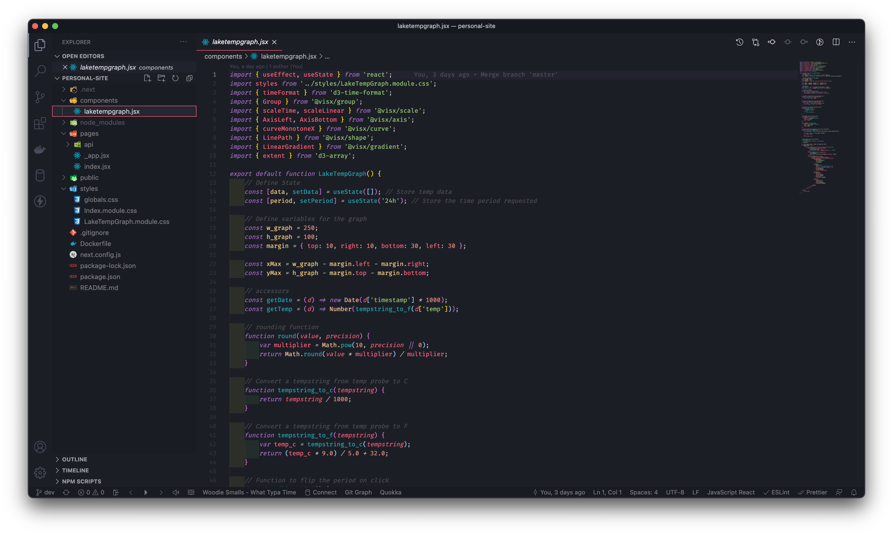
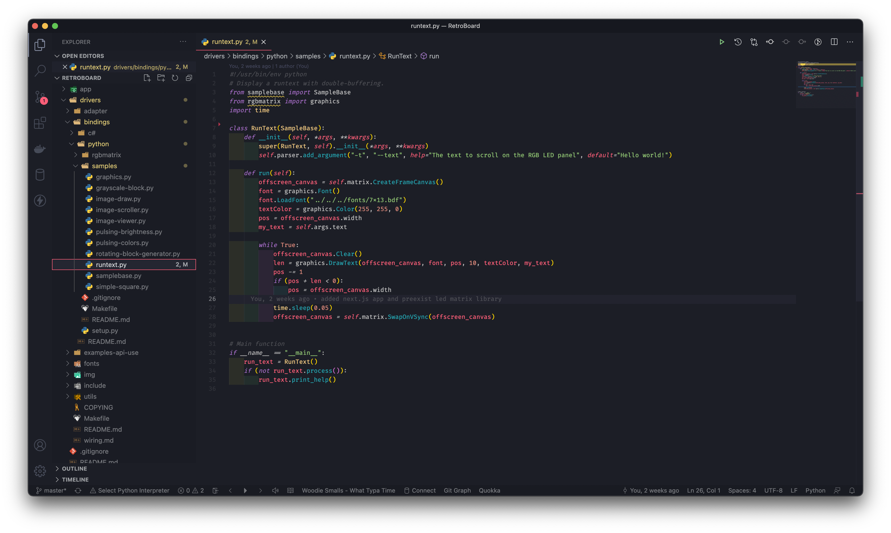
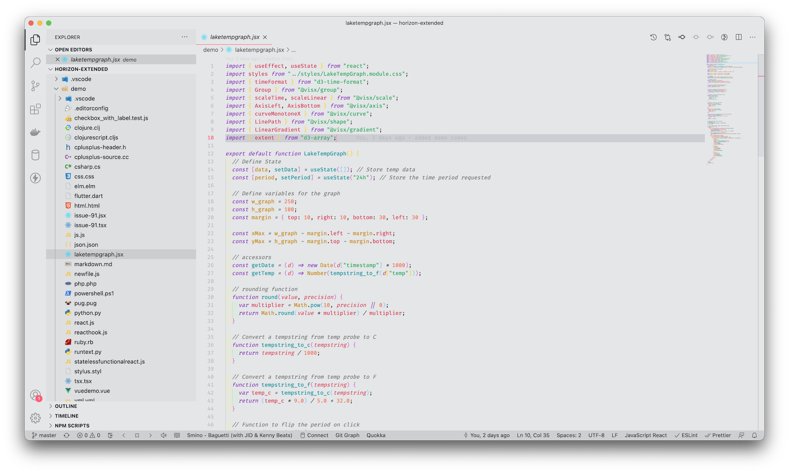

# Horizon Extended

An extension of the [Horizon theme by jolaleye](https://marketplace.visualstudio.com/items?itemName=jolaleye.horizon-theme-vscode)

### A neccessary update to a great theme

I love the color themes and warm tone of Horizon, but it was missing a couple things and semantic highlighting.

Recommended Font: Fira Code w/ ligatures enabled

I only have the main dark theme and a light theme that is based primarily off of the highlighting colors from the dark theme. The light theme struggles with bracket colorizer 2 as the brackets are hard to see. Some customizaiton may be needed for bracket colors. Also, the light theme is VERY colorful. If you are not ready to taste the rainbow then stay away from the light theme. A better readme and more features/themes will come as the theme is used and tested. 

**Enjoy!**