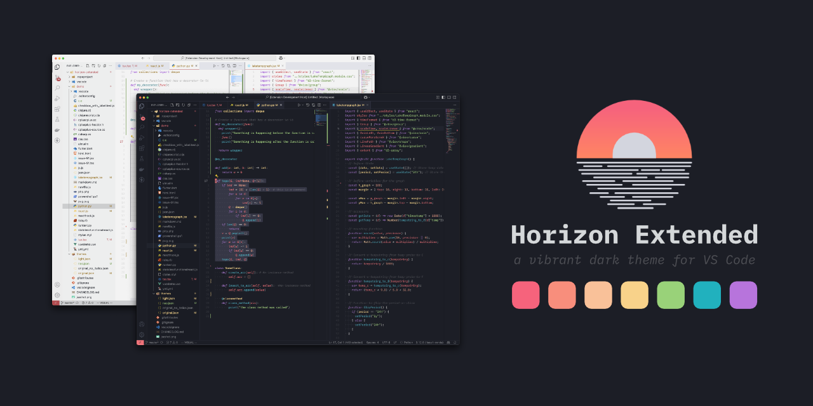
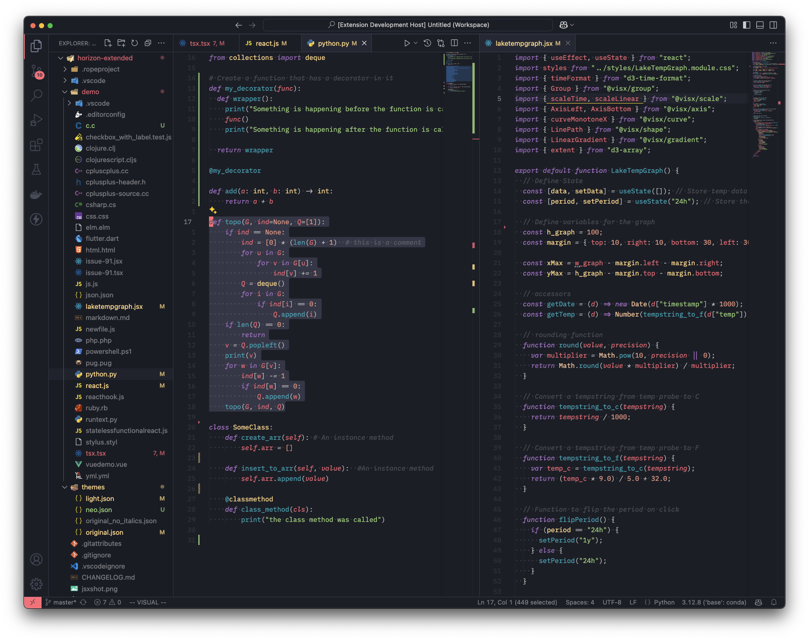
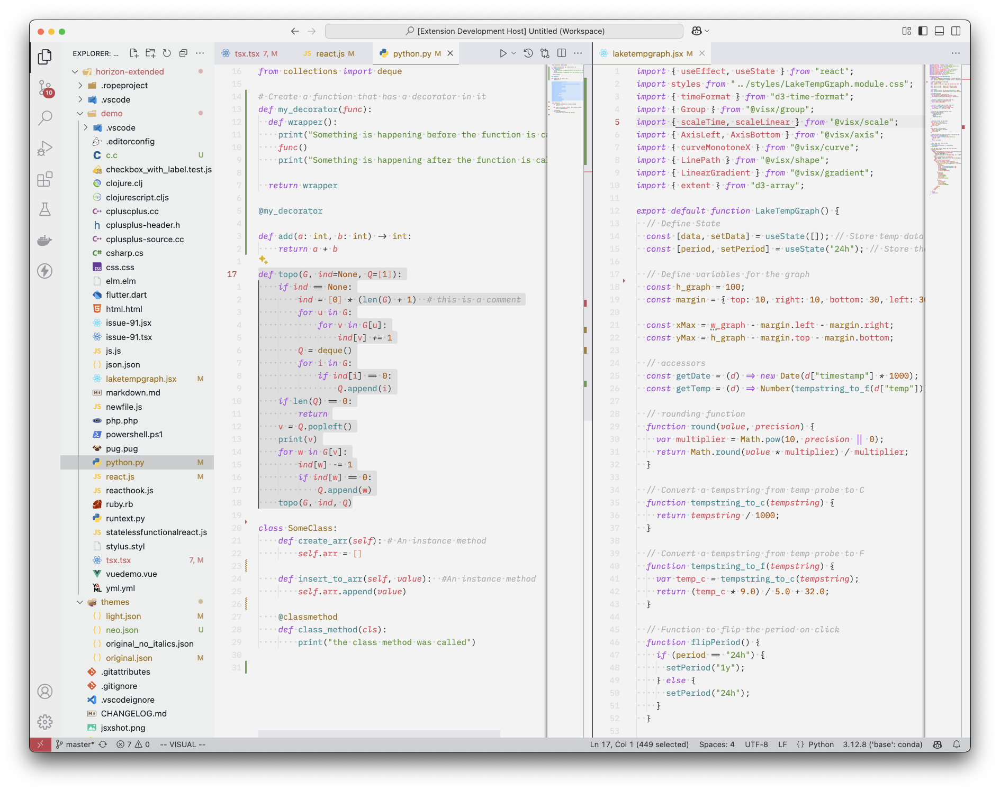

</h3>

A vibrant dark theme for VS Code

    <i>An extension of the <a href="https://marketplace.visualstudio.com/items?itemName=jolaleye.horizon-theme-vscode">Horizon theme by jolaleye</a></i>

# Styles

    
dark

This is the main theme. The original dark theme has been changed to include more consistent color palettees and minimal design based on borders. The original theme has been preserved in two additional themes.

    
light

This is a light theme based on the original dark theme. Borders and other things present in the new dark theme are not present here. This may change in the future.

### A necessary update to a great theme

I love the color themes and warm tone of Horizon, but it was missing a couple things and semantic highlighting.

Recommended Font: Fira Code or Zed Plex Mono

**Enjoy!** ❤️